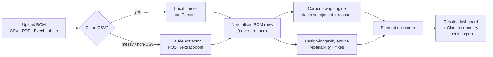
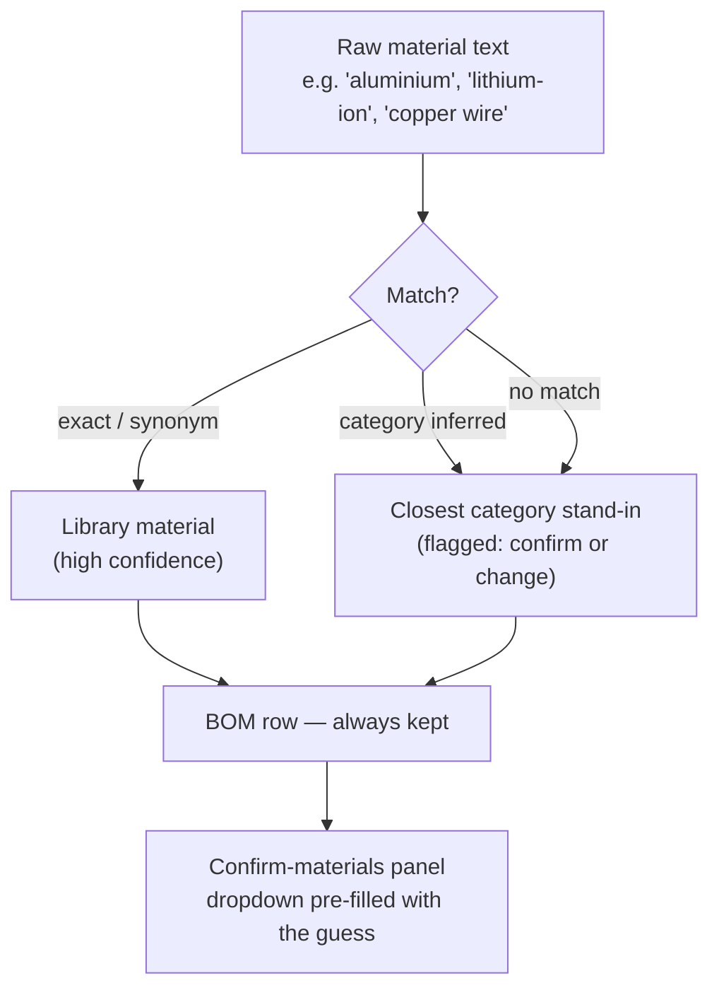
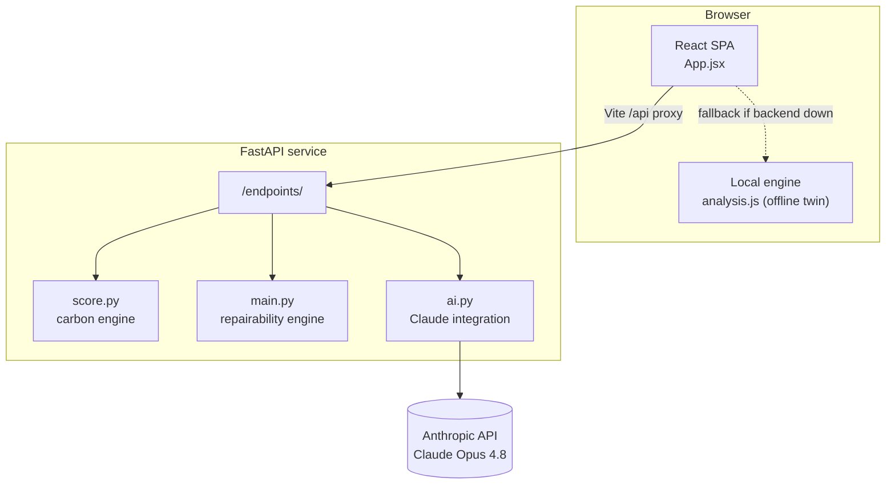

# ecocompass

Carbon and repairability scoring for a bill of materials.

Upload a BOM. ecocompass returns lower-carbon swap candidates per line, the requirement that any rejected candidate failed, a repairability score with design fixes, and a sourced PDF report.

Built for CSESoc Hackathon 2026, sustainability track.

---

## What it does

Two questions are hard to answer at design time:

1. **What else could this be made of?** A material swap trades carbon against cost, strength, service temperature and recyclability. A tool that only reports a lower number is not auditable.
2. **Can it be repaired?** Whether a worn battery means a repair or a landfill dominates a product's lifetime footprint, and a carbon calculator does not measure it.

ecocompass answers both from one BOM. Every figure links to its source.

### Rejected swaps are shown, not hidden

A lower-carbon candidate is only offered if it clears the part's functional requirements: tensile strength, service temperature, food safety, outdoor rating. Candidates that fail are listed with the requirement each one failed, rather than dropped. A part with no viable swap keeps its original material and is flagged.

### Other properties

- **Figures are sourced.** Each material carries embodied carbon, cost, tensile strength, service temperature and recyclability with a primary-source URL and a derivation note. The AI explains figures the deterministic engines computed; it does not produce them.
- **Two engines, one score.** A carbon swap engine and a design-longevity (repairability) engine blend 50/50 into the headline score.
- **Reads most formats.** CSV, Excel, PDF, or a photo of a spec sheet, via Claude vision.
- **No row is dropped.** An unknown material or missing mass is filled with the closest match and flagged for confirmation, so totals stay complete.
- **Runs without the backend.** The frontend ships a local twin of the carbon engine and falls back to it if the API is unreachable.

---

## Features

| Feature | Behaviour |
|---|---|
| BOM ingest | CSV, Excel, PDF, image. Clean CSVs parse client-side; anything else goes to the Claude extractor. |
| Swap ranking | Ranks viable lower-impact materials per component. Lists rejected candidates with the requirement each failed. |
| Carbon/cost priority | A slider re-ranks every swap between cost-weighted and carbon-weighted. |
| Repairability score | Scores the design and lists fixes (fastening, sourcing, modularity) ranked by points recovered. |
| Scaled impact | Per-unit CO₂e saved × annual volume → tonnes/year. |
| Property radar | Original vs. suggested material across carbon, cost, durability, recyclability. |
| Review panels | Guessed materials and estimated masses are surfaced for one-click accept or override. Results update on change. |
| AI summary | Claude writes a summary from the computed figures only, including the reason a swap was refused. |
| PDF export | Sourced report. |
| Material library | 28 materials with full property data and sources, including bio-based recipes from the [Materiom](https://materiom.org) Commons. |
| Consumer scan | Barcode or photo → repairability and carbon score, badged Verified or Estimated. |
| Incentive finder | Web search for grants, rebates and tax credits by region, each with a source link. |

---

## How it works



**1 · Carbon swap engine.** Derives each part's functional requirements (explicit, or inferred from the original material), splits the library into viable candidates (meet every requirement) and rejected ones (with the failing requirement), then ranks the viable pool by a carbon/cost weighted score with a same-material affinity bonus. Each line gets a green/amber/red verdict.

**2 · Design-longevity engine.** Matches components and materials against a reference library (`data/*.csv` + `scoring_rules.json`) to score repairability from fastening and sourcing, and emits ranked design fixes.

**3 · Blended score.** 50/50 carbon and repairability, graded A–F.

**4 · AI layer (Claude Opus 4.8).** `extract_bom` turns arbitrary files into structured rows and maps materials to the library. `generate_narrative` writes the summary from already-computed JSON, so it can explain but not fabricate.

### Ingestion

A malformed CSV used to lose components: an unknown material was dropped, a missing mass became a flat 1 kg. Every row now survives.



Missing masses are pre-filled with a Claude estimate (marked `EST`) that you accept or edit, so carbon and cost totals always reflect a real number.

---

## Architecture



```
csesoc-hackathon-2026/
├── frontend/                     # React + Vite single-page app
│   ├── public/samples/           # demo BOM CSVs — good / mixed / bad
│   └── src/
│       ├── App.jsx               # UI: upload, results, material library
│       ├── analysis.js           # carbon swap engine (local twin of score.py)
│       ├── bomParser.js          # CSV parsing + material resolver
│       ├── materials.js          # 28-material library + demo BOM
│       ├── pdfReport.js          # jsPDF report export
│       ├── api.js                # backend client (through /api proxy)
│       ├── scan/                 # consumer barcode/photo scan mode
│       └── theme.css             # design tokens + responsive layer
└── backend/                      # FastAPI service
    ├── api/
    │   ├── main.py               # HTTP endpoints + CORS + .env loading
    │   └── scan.py               # scan endpoints + provenance labels
    ├── main/
    │   ├── ai.py                 # Claude: extract_bom, narrative, resolver
    │   ├── score.py              # carbon swap engine (port of analysis.js)
    │   ├── main.py               # repairability / design-longevity engine
    │   └── parse.py              # CSV → rows
    ├── data/
    │   ├── material_library.csv  # material reference (aliases, repair notes)
    │   ├── component_library.csv # component reference (failure risk, life)
    │   └── scoring_rules.json    # repairability scoring rules
    └── requirements.txt
```

---

## Quickstart

Requires Node.js 18+ and Python 3.11+.

An Anthropic API key ([console.anthropic.com](https://console.anthropic.com)) is optional. Without one the app runs on its local engine; only file extraction and the AI summary need it.

### Backend

```bash
cd backend
python -m venv .venv && source .venv/bin/activate      # Windows: .venv\Scripts\activate
pip install -r requirements.txt

cp .env.example .env                                    # then paste your key into .env
#   ANTHROPIC_API_KEY=sk-ant-...

python -m uvicorn api.main:app --reload --port 8000
```

Health check: <http://localhost:8000/> → `{"service":"ecocompass","status":"ok","ai":true,…}`

### Frontend

```bash
cd frontend
npm install
npm run dev
```

Open <http://localhost:5173>. Vite proxies `/api` → `http://localhost:8000`.

With no key, use **Analyze sample BOM** or the Clean / Mixed / Messy sample chips to run on bundled data.

---

## API

Base URL `http://localhost:8000`. The frontend reaches these through the `/api` proxy.

| Method | Endpoint | Purpose |
|---|---|---|
| `GET`  | `/` | Health check + endpoint index (`ai: true/false`). |
| `POST` | `/extract-bom` | File (image / PDF / Excel / CSV) → structured BOM rows, via Claude. |
| `POST` | `/analyze-bom` | BOM + weights → per-line swap analysis, repairability, blended score. |
| `POST` | `/narrative` | A computed analysis → summary text (Claude). |
| `POST` | `/library-compare` | BOM → reference-library matches (failure risk, service life, recycling). |
| `POST` | `/upload-csv` | Raw CSV → parsed rows. |
| `POST` | `/incentives` | Region → government incentives via web search, with source links. |
| `POST` | `/scan-barcode` | GTIN → product identity + repairability + carbon score. |
| `POST` | `/scan-photo` | Product image → same, via vision. |
| `POST` | `/contribute-product` | Submit data for an unscored product. |

<details>
<summary>Example — extract a messy CSV</summary>

```bash
curl -X POST http://localhost:8000/extract-bom -F "file=@messy.csv"
```
```jsonc
{
  "rows": [
    { "component": "Battery", "from": "ABS", "kg": 0.34,
      "materialConfidence": "proxy", "materialRaw": "lithium-ion",
      "materialReason": "\"lithium-ion\" is not in the swap library. Using ABS as a placeholder. Confirm or pick a better fit." },
    { "component": "Rear casing", "from": "aluminum_6061", "kg": 0.15,
      "kgMissing": true, "kgEstimated": true }
  ],
  "warnings": ["1 material was not in the swap library. The closest match was filled in for you to confirm."],
  "meta": { "productName": "Electronic Device", "componentCount": 2, "totalKg": 0.49 }
}
```
</details>

---

## Data

- **28-material swap library** covering metals, plastics, wood, bioplastics and composites, including 10 bio-based recipe families from the [Materiom](https://materiom.org) Commons. Each entry carries embodied carbon, cost, tensile strength, service temperature, recyclability, durability and outdoor/food ratings, with a primary-source URL and a derivation note.
- **Reference libraries** (`backend/data/`) drive repairability: `material_library.csv`, `component_library.csv` (aliases, failure risk, service life, repair notes) and `scoring_rules.json`.
- Figures are estimates. Materiom-derived numbers are marked *indicative*.

## Stack

| Layer | Tools |
|---|---|
| Frontend | React 18, Vite 5, Recharts 3, jsPDF |
| Backend | FastAPI, Uvicorn, python-multipart, openpyxl, python-dotenv |
| AI | Anthropic Python SDK, Claude Opus 4.8 (vision extraction, narrative) and Sonnet (repairability estimates), with prompt caching |
| Data | CSV/JSON libraries; Materiom Commons for bio-based materials |

## Screenshots

Screenshots live in [`docs/screenshots/`](docs/screenshots).

| Landing | Results | Review panels |
|---|---|---|
|  |  |  |

## Roadmap

- [ ] Persist analyses and share via link
- [ ] Extend the swap library to electronics (battery chemistries, PCBs, glass) so more components get real swaps rather than placeholders
- [ ] Account for out-of-scope parts in a mass-only lane
- [ ] Regional carbon-intensity factors for manufacturing energy
- [ ] Batch / multi-product view

## Team

Built at CSESoc Hackathon 2026 by:

- **Cathlyn Widjaja** ([@cw-lynne](https://github.com/cw-lynne)) — backend: FastAPI service, CSV pipeline, reference libraries
- **Donald Chung** — frontend, carbon + repairability engines, Claude integration

## Credits

- [Materiom](https://materiom.org) — open recipes for bio-based materials
- Embodied-carbon figures informed by the ICE database and cited LCA literature (see each material's `source_note`)
- AI features use [Anthropic Claude](https://www.anthropic.com)

## License

[MIT](LICENSE) © 2026 the ecocompass team
